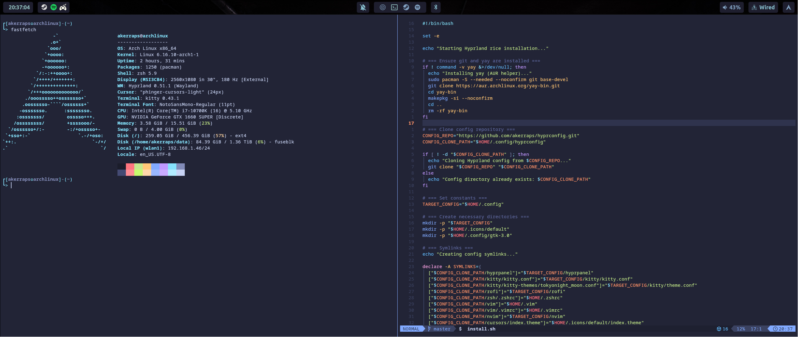
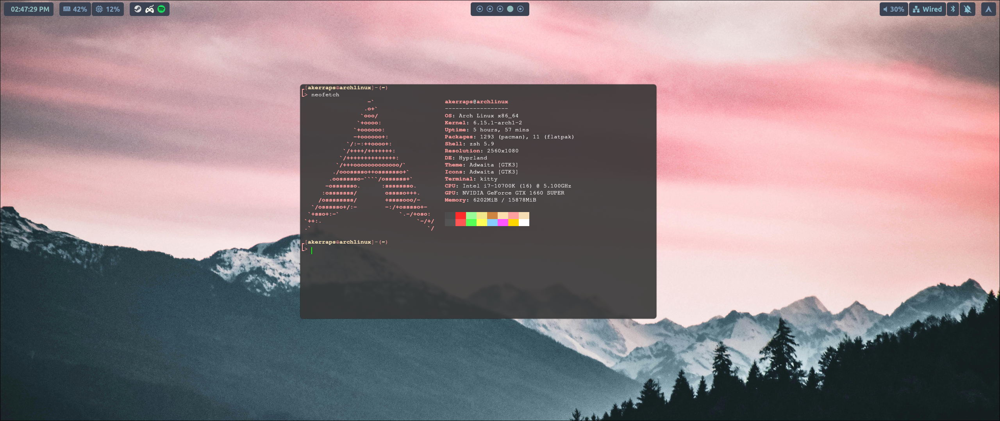

# 🌿 My First Hyprland Rice

Welcome to my very first **rice** using **Hyprland** — a dynamic and highly customizable Wayland compositor.
This setup is still **a work in progress**, so some parts are unfinished or not fully configured yet.

---

## 🎨 Screenshots





---

## 🗂️ Current Setup

- **Hyprpanel** — custom **Nord**-inspired theme with transparent blurred background and widgets for workspace, clock, and system info.
- **Kitty Terminal** — fast, GPU-accelerated terminal emulator.
- **Rofi** — lightweight and highly configurable application launcher.
- **zsh** — my default shell, powered by **Oh My Zsh** with the `zsh-autosuggestions` plugin for command suggestions, aliases, and a custom prompt theme.
- **Neovim** — Main editor, configured with shared Vim/Neovim settings, plugins, and themes via vim-plug.
- **SDDM** — Display/login manager with a minimal silent theme and custom configuration.
- **GRUB** — Customized bootloader with themed setup from the repo.

---

## ⚙️ Full Installation Guide

This guide installs all the essential packages and creates the necessary config symlinks to replicate this rice.
It’s intended for **Arch Linux** or Arch-based distributions.

---

## 🚀 Quick Setup (Copy & Paste)

```bash
git clone https://github.com/akerraps/hyprconfig.git ~/.config/hyprconfig && bash ~/.config/hyprconfig/install.sh
```

### 📦 What’s Included

| Component                         | Description                                                                                      |
|-----------------------------------|--------------------------------------------------------------------------------------------------|
| **uwsm**                          | Wayland session manager required by Hyprland                                                     |
| **nerd-fonts**                    | Icon-rich fonts (Font Awesome, Nerd icons) for panels, prompts, and terminals                    |
| **rofi**                          | Fast, highly customizable application launcher                                                   |
| **antimicrox**                    | Map game controller buttons to keyboard and mouse actions                                        |
| **xdg-desktop-portal-hyprland**   | Enables screen sharing, portal integrations, and desktop environment interoperability            |
| **hyprpolkitagent**               | GUI Polkit agent to handle authentication prompts (e.g. sudo password dialogs)                   |
| **wireplumber**                   | PipeWire session and policy manager for audio                                                    |
| **qt5-wayland**, **qt6-wayland**  | Ensures that Qt5/Qt6 applications run smoothly under Wayland                                     |
| **imv**                           | Lightweight, simple image viewer for quick previews                                              |
| **swww**                          | Wallpaper daemon for setting and transitioning backgrounds dynamically                           |
| **hyprshot**                      | Screenshot tool specifically designed for Wayland and Hyprland                                   |
| **cliphist**                      | Clipboard manager for Wayland                                                                    |
| **kitty**                         | GPU-accelerated terminal emulator                                                                |
| **dolphin**                       | KDE file manager                                                                                 |
| **nvim + vim**                    | Editors pre-configured with **vim-plug** and symlinked configs                                   |
| **zsh + Oh My Zsh**               | Modern shell with plugins (autosuggestions, themes, etc.)                                        |
| **sddm**                          | Display/login manager, themed via custom configs                                                 |
| **grub-themes**                   | Custom GRUB theme installer included                                                             |
| **spotify-launcher**              | Lightweight Spotify launcher                                                                     |
| **hyprcursor**                    | Cursor theme support for Hyprland                                                                |
| **hyprpicker**                    | Wayland-compatible color picker                                                                  |
| **ags-hyprpanel-git** *(AUR)*     | Fully customizable status bar (panel) for Hyprland                                               |
| **sddm-silent-theme** *(AUR)*     | Minimal SDDM theme for a clean login experience                                                  |
| **phinger-cursors** *(AUR)*       | High-quality cursor theme                                                                        |
| **aylurs-gtk-shell-git** *(AUR)*  | Shell environment framework used by Hyprpanel                                                    |
| **wf-recorder-git** *(AUR)*       | Screen recording tool for Wayland                                                                |
| **matugen-bin** *(AUR)*           | Dynamic material-based color scheme generator                                                    |
| **python-gpustat** *(AUR)*        | GPU monitoring tool for terminals                                                                |
| **zen-browser-bin** *(AUR)*       | Web browser                                                                      |
| **brave-bin** *(AUR)*             | Chromium-based web browser with privacy enhancements                                             |
| **go + gopls**                    | Go language support and LSP server installed via `go install`                                    |
| **Extras**                        | Utilities like `curl`, `tree`, `btop`, `bluez`, `gvfs`, `ntfs-3g`, `wl-clipboard`, etc. for usability |

---

In addition to packages, the installer also:

- Creates **symlinks** for all configs in `~/.config`, `~/.zshrc`, `~/.vim`, `nvim`, cursors, etc.
- Installs **vim-plug** for both Vim and Neovim.
- Automatically configures **Oh My Zsh** with `zsh-autosuggestions`.
- Runs the **GRUB theme installer** if available.
