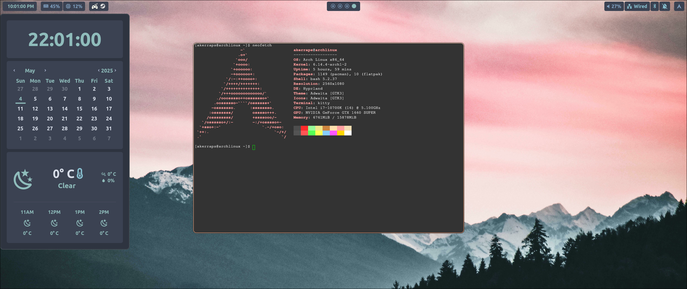

# 🌿 My First Hyprland Rice

This is my very first *rice* using **Hyprland**, a dynamic and highly customizable Wayland compositor.
It's still a **work in progress**, so some components are unfinished or unconfigured.

### Current Setup:
- **Hyprpanel** with a modified **Nord** theme
- Terminal: **Kitty**
- Launcher: **Rofi**



## 🛠️ Full Installation Guide

This guide sets up the essential packages and config symlinks required for this rice.
It’s designed for Arch Linux (or Arch-based distros), and assumes you already have yay installed.

## 🚀 Quick Setup (Copy & Paste)

```bash
# --- Link your configuration files ---
mkdir -p ~/.config

ln -s ~/.config/hypr/hyprpanel/ ~/.config/hyprpanel # Hyprpanel
ln -s ~/.config/hypr/kitty/ ~/.config/kitty         # Kitty terminal config
ln -s ~/.config/hypr/rofi/ ~/.config/rofi           # Rofi launcher config
ln -s ~/.config/hypr/zsh/.zshrc ~                   # zsh config
ln -s ~/.config/hypr/vim/.vimrc ~                   # vim config
ln -s ~/.config/hypr/vim ~/.vim                     # vim config

# --- Core packages and tools ---
sudo pacman -S \
  uwsm \                                # Wayland session manager (needed by Hyprland)
  nerd-fonts \                          # Icon-rich fonts (includes Font Awesome)
  rofi \                                # Application launcher
  antimicrox \                          # Map gamepad buttons to keyboard/mouse
  xdg-desktop-portal-hyprland \         # Enables screen sharing and other Wayland features
  hyprpolkitagent \                     # Polkit agent for GUI sudo prompts
  qt5-wayland qt6-wayland \             # Qt apps support in Wayland
  imv \                                 # Lightweight image viewer
  catppuccin-gtk-theme \                # Nice-looking GTK theme
  swww \                                # Wallpaper daemon used by hyprpanel
  curl

# --- AUR packages (via yay) ---
yay -S \
  hyprshot \                            # Screenshot tool for Wayland
  ags-hyprpanel-git                     # Customizable Hyprland panel

# --- Optional: Install WhatsApp Web as a PWA ---
# Open WhatsApp Web in Chromium/Firefox and install it as an app (PWA).
# This enables it to autostart with the session.

sh -c "$(curl -fsSL https://raw.githubusercontent.com/ohmyzsh/ohmyzsh/master/tools/install.sh)"
```

## 📦 What’s Included
| Component                    | Purpose                                                             |
|-----------------------------|----------------------------------------------------------------------|
| `uwsm`                      | Starts and manages Wayland sessions                                  |
| `nerd-fonts`                | Provides icon fonts (e.g. Font Awesome, for launchers and panels)    |
| `rofi`                      | Fast and customizable application launcher                           |
| `antimicrox`                | Maps game controller inputs to keyboard/mouse                        |
| `xdg-desktop-portal-hyprland` | Enables screen sharing, global shortcuts, etc.                   |
| `hyprpolkitagent`           | GUI agent for authentication prompts (e.g. password dialogs)         |
| `qt5-wayland`, `qt6-wayland` | Ensures Qt apps (e.g. KDE apps) work properly under Wayland        |
| `imv`                       | Lightweight and minimal image viewer                                 |
| `catppuccin-gtk-theme`      | GTK theme for a cohesive visual style                                |
| `swww`                      | Wallpaper daemon used with panels like hyprpanel                     |
| `hyprshot` (AUR)            | Screenshot utility for Hyprland                                      |
| `ags-hyprpanel-git` (AUR)   | Customizable status bar for Hyprland                                 |

## ✅ Requirements
- Arch Linux or Arch-based distro
- `yay` installed
- Hyprland config files under ~/.config/hypr/
