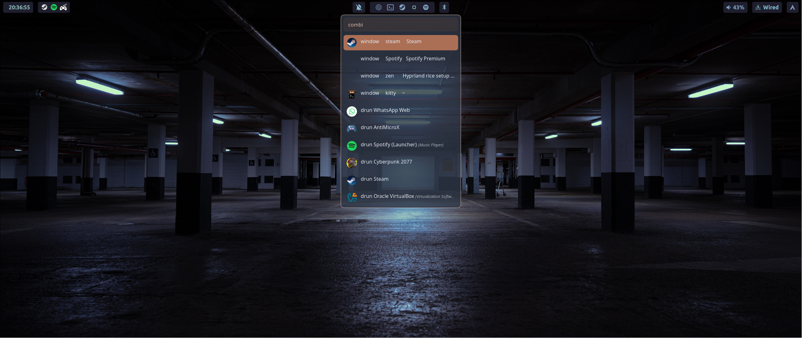

# Hyprland Rice Setup

This repository contains my personal **Hyprland rice** for Arch Linux.  
The configuration is based on the **Tokyo Night** color theme, applied consistently across **Neovim**, **hyprpanel** and the **Kitty terminal**, aiming for a cohesive and visually calm environment.

> Note: The Neovim configuration included here is **in development** and not yet finalized. It’s adapted to my personal workflow and based on [lazyVim](https://www.lazyvim.org/) and will continue to evolve over time.

---

## Overview

This setup provides a complete and reproducible Hyprland environment with a focus on aesthetics, performance, and customization.  
It automates package installation, configuration linking, and theming through a single installation script.

---

## Screenshots




---

## Features

- **Tokyo Night Theme Integration** — consistent appearance across terminal, Neovim, and UI components.
- **Hyprpanel** — custom setup with a transparent, blurred background and minimal widgets.
- **Kitty Terminal** — GPU-accelerated terminal configured with the Tokyo Night theme and custom keybindings.
- **Rofi** — minimal application launcher for quick and efficient workflows, with clipboad integration.
- **Zsh with Oh My Zsh** — enhanced shell environment with autosuggestions and custom prompt.
- **Neovim** — customized editor using vim-plug, currently a work in progress.
- **SDDM + GRUB** — both themed for a clean, cohesive system experience.

---

## Installation

This rice is designed for **Arch Linux** and Arch-based distributions.  
To install, simply run the following command:

```bash
git clone https://github.com/akerraps/hyprconfig.git ~/.config/hyprconfig && bash ~/.config/hyprconfig/install.sh
```

This script performs a complete setup:

- Installs all required **core and AUR packages**.  
- Creates **symlinks** for configuration files in appropriate directories.  
- Installs **vim-plug** for both Vim.  
- Sets up **Oh My Zsh** with `zsh-autosuggestions`.  
- Runs optional **GRUB theme installation** if available.  

---

## Package Overview

| Component                         | Description                                                                                      |
|-----------------------------------|--------------------------------------------------------------------------------------------------|
| **Hyprland + Hyprpanel**          | Main compositor and customizable panel environment                                               |
| **uwsm**                          | Wayland session manager                                                                          |
| **nerd-fonts**                    | Icon-rich font set for terminal, status bars, and prompts                                        |
| **rofi**                          | Lightweight launcher and application menu                                                        |
| **antimicrox**                    | Controller-to-keyboard mapping utility                                                           |
| **xdg-desktop-portal-hyprland**   | Portal integration for screen sharing and compatibility                                          |
| **wireplumber + PipeWire**        | Modern audio management stack                                                                    |
| **qt5/qt6-wayland**               | Wayland compatibility for Qt applications                                                        |
| **imv**                           | Lightweight image viewer                                                                         |
| **swww**                          | Wallpaper daemon supporting smooth transitions                                                   |
| **hyprshot**                      | Wayland screenshot tool                                                                          |
| **cliphist**                      | Clipboard manager for Wayland                                                                    |
| **kitty**                         | Terminal emulator themed with Tokyo Night                                                        |
| **dolphin**                       | KDE file manager                                                                                 |
| **nvim / vim**                    | Editors with shared configuration and plugin management via vim-plug                             |
| **zsh + Oh My Zsh**               | Default shell with plugins and enhanced usability                                                |
| **sddm**                          | Display/login manager with silent theme                                                          |
| **grub-themes**                   | Themed bootloader customization                                                                  |
| **spotify-launcher**              | Lightweight launcher for Spotify                                                                 |
| **hyprcursor / phinger-cursors**  | Cursor theme support for Wayland                                                                 |
| **hyprpicker**                    | Wayland color picker utility                                                                     |
| **AUR Packages**                  | Includes `ags-hyprpanel-git`, `sddm-silent-theme`, `aylurs-gtk-shell-git`, `matugen-bin`, `zen-browser-bin`, among others |
| **Extras**                        | Essential utilities (`curl`, `btop`, `tree`, `wl-clipboard`, `bluez`, `gvfs`, `reflector`, etc.) |

---

## Configuration Notes

- All configuration files are managed through **symlinks** from `~/.config/hyprconfig`.  
- The **Tokyo Night** color palette is applied across:  
  - **Kitty Terminal** (`tokyonight_moon.conf`)  
  - **Neovim** (customized Lua configuration, work in progress)  
- **Oh My Zsh** is automatically configured with the `zsh-autosuggestions` plugin.  
- **Reflector** is enabled to maintain an optimized mirror list.  

---

## Development Status

The setup is **functional and stable** for daily use, but the **Neovim configuration is under active development**.  
Future updates will include refined LSP integration, improved keybindings, and a more modular plugin structure.

---

## License

This project is open for personal use and adaptation.  
Attribution is appreciated if you reuse or modify parts of this configuration.
